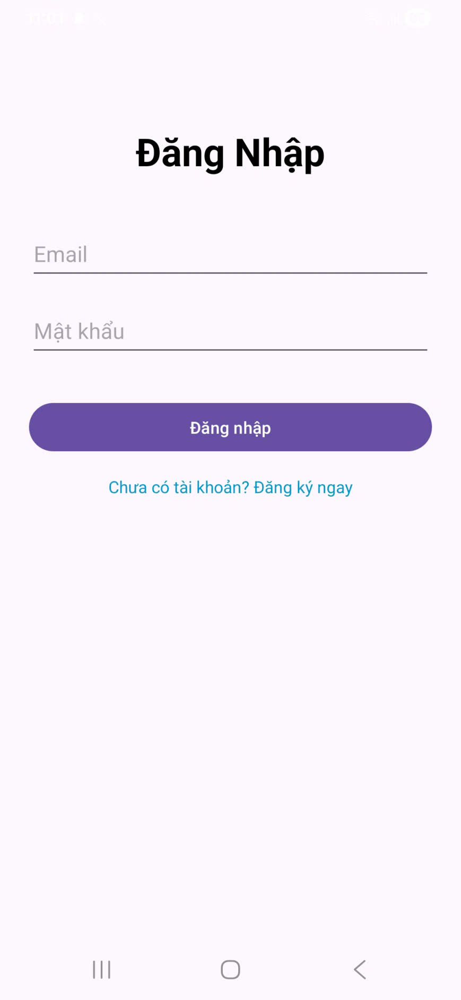
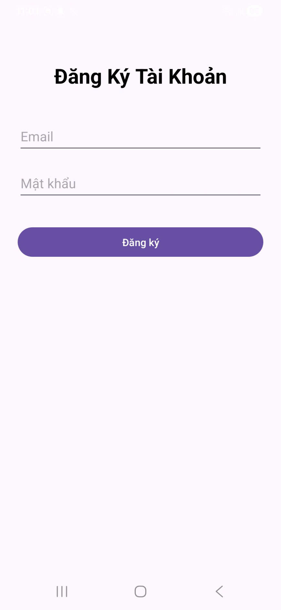
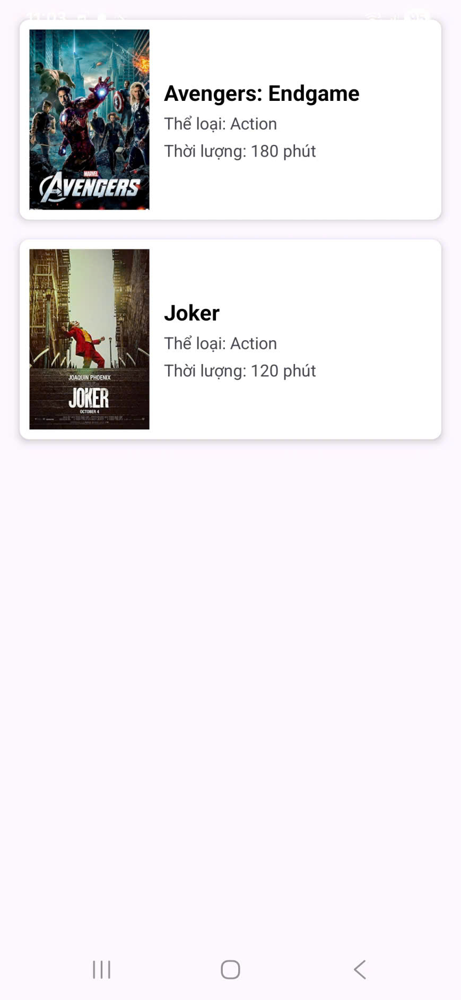
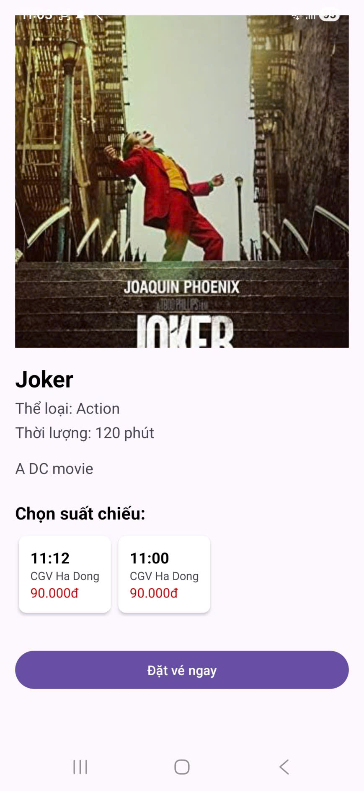
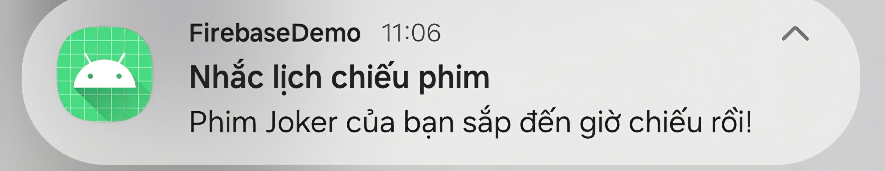

# 🎬 Movie Ticket App - Firebase Demo

Ứng dụng đặt vé xem phim trực tuyến được xây dựng bằng ngôn ngữ **Java** trên nền tảng **Android Studio**, tích hợp hệ sinh thái **Firebase** để quản lý dữ liệu và thông báo.

---

## 📸 Giao diện ứng dụng (Screenshots)

|                                   Đăng nhập                                    |                                    Đăng ký                                    |                                  Danh sách phim                                   |                                   Chi tiết & Đặt vé                                    |                                   Thông báo                                   |
|:------------------------------------------------------------------------------:|:-----------------------------------------------------------------------------:|:---------------------------------------------------------------------------------:|:--------------------------------------------------------------------------------------:|:-----------------------------------------------------------------------------:|
|  |  |  |  |  |
|                        *Mô tả: Đăng nhập qua Firebase*                         |                        *Mô tả: Đăng ký qua Firestore*                         |                       *Mô tả: Danh sách phim từ Firestore*                        |                           *Mô tả: Chọn suất chiếu & Đặt vé*                            |                       *Mô tả: Thông báo phim sắp chiếu*                       | 

---

## ✨ Tính năng chính

1.  **Firebase Authentication**:
    *   Đăng ký tài khoản mới bằng Email/Password.
    *   Đăng nhập an toàn, lưu trạng thái đăng nhập.
2.  **Cloud Firestore Database**:
    *   Hiển thị danh sách phim thời gian thực (Real-time).
    *   Quản lý thông tin chi tiết phim, rạp và suất chiếu.
    *   Lưu trữ thông tin vé đã đặt (`tickets`).
3.  **Glide Image Loading**:
    *   Tải ảnh Poster phim mượt mà từ URL (Cloud Storage/Web).
4.  **Alarm Manager & Notifications**:
    *   Tự động nhắc lịch chiếu phim trước **30 phút**.
    *   Hỗ trợ hiển thị thông báo ngay cả khi ứng dụng đang tắt.
5.  **Firebase Cloud Messaging (FCM)**:
    *   Nhận thông báo đẩy từ hệ thống/quản trị viên.

---

## 🚀 Công nghệ sử dụng

*   **Ngôn ngữ**: Java
*   **UI/UX**: ConstraintLayout, View Binding, RecyclerView, CardView.
*   **Backend**: Firebase (Auth, Firestore, Messaging).
*   **Thư viện**: Glide (Load ảnh), Material Components.

---

    